# Plateforme intégrée de gestion et de suivi des barrages — ABHL

**Application web métier développée dans le cadre d’un stage au sein de l’Agence du Bassin Hydraulique du Loukkos (ABHL).**

Cette plateforme a été conçue pour centraliser le suivi hydraulique des barrages, structurer les données métier, fiabiliser les calculs, faciliter l’analyse, automatiser certaines restitutions et intégrer des fonctionnalités avancées de recherche et d’interrogation des données.

> **Version publique du projet**
>
> Ce dépôt contient une version assainie de la plateforme développée au sein de l’ABHL.  
> Il présente l’architecture, les principaux modules métier, le code applicatif et les interfaces, sans exposer les données opérationnelles, les sauvegardes de base de données, les identifiants, les secrets, les documents internes ni les fichiers métier confidentiels de l’agence.

---

## Sommaire

- [Contexte du projet](#contexte-du-projet)
- [Objectifs](#objectifs)
- [Vue d’ensemble](#vue-densemble)
- [Architecture technique](#architecture-technique)
- [Fonctionnalités principales](#fonctionnalités-principales)
  - [Authentification et sécurité](#1-authentification-et-sécurité)
  - [Tableau de bord hydraulique](#2-tableau-de-bord-hydraulique)
  - [Assistant intelligent de données](#3-assistant-intelligent-de-données)
  - [Situation quotidienne](#4-situation-quotidienne)
  - [Annonce mensuelle](#5-annonce-mensuelle)
  - [BILAN mensuel](#6-bilan-mensuel)
  - [Gestion des barrages](#7-gestion-des-barrages)
  - [Gestion et versionnement des barèmes](#8-gestion-et-versionnement-des-barèmes)
  - [Administration des utilisateurs](#9-administration-des-utilisateurs)
- [Logique métier hydraulique](#logique-métier-hydraulique)
- [Gestion des données](#gestion-des-données)
- [Sécurité de l’assistant NL-to-SQL](#sécurité-de-lassistant-nl-to-sql)
- [Stack technique](#stack-technique)
- [Organisation du projet](#organisation-du-projet)
- [Confidentialité de cette version publique](#confidentialité-de-cette-version-publique)

---

# Contexte du projet

Le suivi quotidien et mensuel des barrages repose sur plusieurs types de données hydrauliques, sur des règles métier précises et sur des fichiers de restitution utilisés dans les processus de travail de l’agence.

Le projet vise à faire évoluer cette organisation vers une **plateforme centralisée et structurée**, capable de relier :

- les données hydrauliques ;
- les calculs métier ;
- les barèmes cote / volume / surface ;
- les bilans journaliers et mensuels ;
- les restitutions ;
- les imports ;
- les exports ;
- les utilisateurs ;
- les rôles et droits d’accès ;
- les outils d’analyse ;
- un assistant de données en langage naturel.

La plateforme ne cherche donc pas uniquement à remplacer des fichiers Excel par une interface web. Elle met en place un **système métier complet**, organisé autour d’une base PostgreSQL et de services backend dédiés.

---

# Objectifs

Les principaux objectifs du projet sont :

- centraliser les données hydrauliques dans PostgreSQL ;
- réduire la dispersion des informations entre plusieurs fichiers ;
- fiabiliser les calculs utilisés dans les différents modules ;
- conserver la logique métier existante tout en la structurant ;
- permettre le suivi quotidien et mensuel des barrages ;
- faciliter l’analyse grâce à un tableau de bord interactif ;
- automatiser la préparation des principales restitutions ;
- gérer les barèmes avec une logique de versionnement temporel ;
- administrer les barrages de manière dynamique ;
- sécuriser les accès selon les rôles ;
- assurer une meilleure traçabilité des opérations ;
- permettre l’interrogation des données en langage naturel sans donner au modèle d’IA un accès libre à la base.

---

# Vue d’ensemble

La plateforme couvre plusieurs dimensions du système métier :

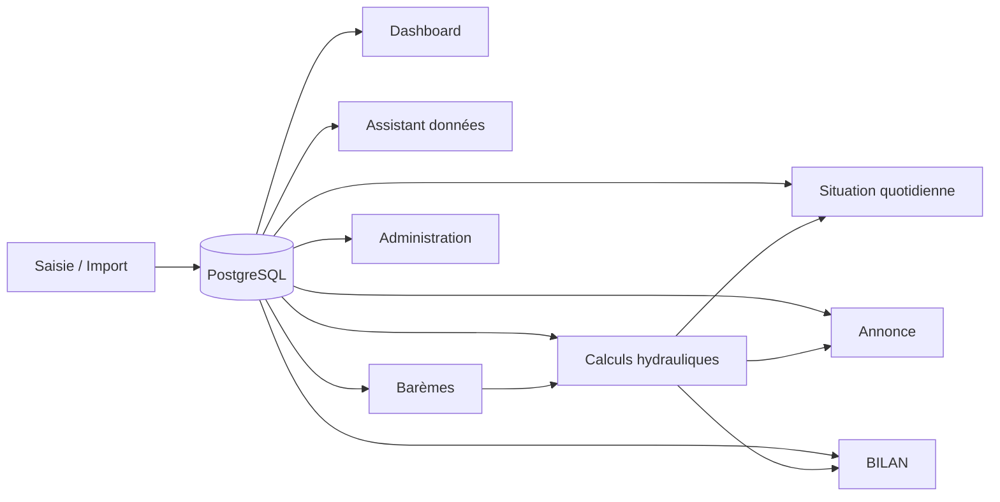

Le principe central est simple :

> **une donnée structurée, une logique métier centralisée et plusieurs usages applicatifs autour du même socle.**

---

# Architecture technique

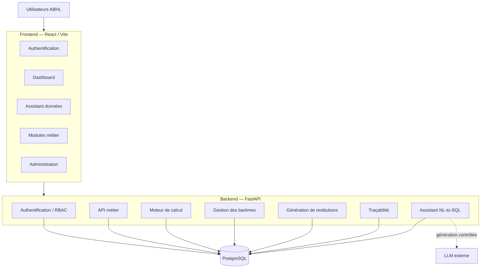

L’application est organisée autour de trois couches principales :

### Frontend

Interface développée avec **React et Vite**.

Elle prend en charge :

- la navigation ;
- les formulaires métier ;
- les filtres ;
- les visualisations ;
- les tableaux ;
- les interactions utilisateur ;
- les écrans d’administration ;
- l’assistant de données.

### Backend

API développée avec **FastAPI**.

Elle centralise :

- les routes métier ;
- la validation ;
- la sécurité ;
- l’authentification ;
- les règles métier ;
- les calculs hydrauliques ;
- la gestion des barèmes ;
- les imports ;
- les exports ;
- la génération documentaire ;
- l’orchestration de l’assistant.

### Base de données

**PostgreSQL** constitue le socle de persistance principal.

La base stocke notamment :

- les barrages ;
- les référentiels ;
- les journées de situation ;
- les bilans ;
- les restitutions ;
- les transferts ;
- les mesures spécifiques ;
- les versions de barèmes ;
- les points cote / volume / surface ;
- les utilisateurs ;
- les rôles ;
- les sessions ;
- les événements d’audit.

---

# Fonctionnalités principales

## 1. Authentification et sécurité

La plateforme dispose d’un système d’authentification intégré permettant de contrôler l’accès aux différentes fonctionnalités.

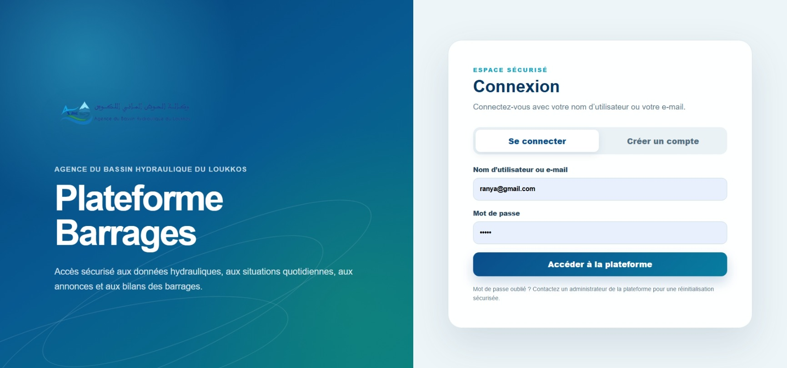

Le système prend en charge notamment :

- l’authentification des utilisateurs ;
- les sessions ;
- les jetons JWT ;
- les rôles ;
- les permissions ;
- le changement de mot de passe ;
- l’activation ou désactivation des comptes ;
- la gestion administrative des utilisateurs ;
- la journalisation de certaines actions ;
- les restrictions d’accès aux opérations sensibles.

L’objectif est de garantir que chaque utilisateur accède uniquement aux fonctionnalités correspondant à son rôle.

---

## 2. Tableau de bord hydraulique

Le tableau de bord regroupe les principaux indicateurs nécessaires au suivi des barrages.

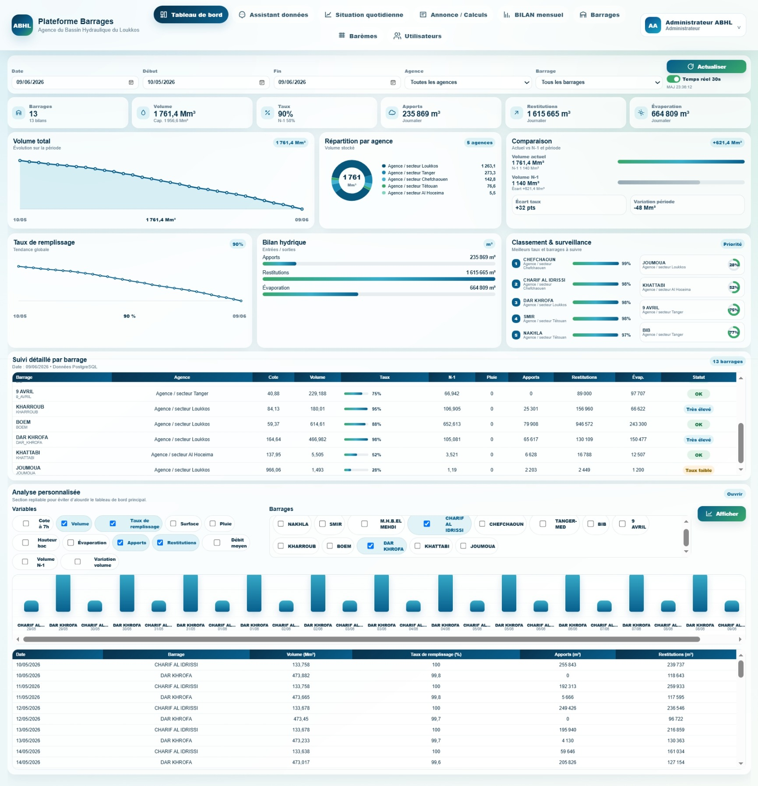

Il permet notamment de consulter :

- le nombre de barrages suivis ;
- le volume stocké ;
- le taux de remplissage ;
- les apports ;
- les restitutions ;
- l’évaporation ;
- les évolutions temporelles ;
- les comparaisons entre barrages ;
- les comparaisons avec des périodes de référence ;
- les indicateurs individuels ;
- les situations nécessitant une attention particulière.

Le tableau de bord permet de passer d’une **vision globale** à une **analyse détaillée** selon le barrage, la période ou le type d’indicateur.

### Analyse multi-variable

Les analyses peuvent exploiter plusieurs grandeurs hydrauliques, par exemple :

- cote ;
- volume ;
- taux de remplissage ;
- surface ;
- pluie ;
- hauteur bac ;
- évaporation ;
- apports ;
- restitutions ;
- débit ;
- variation de réserve ;
- références N-1.

---

## 3. Assistant intelligent de données

La plateforme intègre un assistant capable d’interroger les données des barrages en langage naturel.

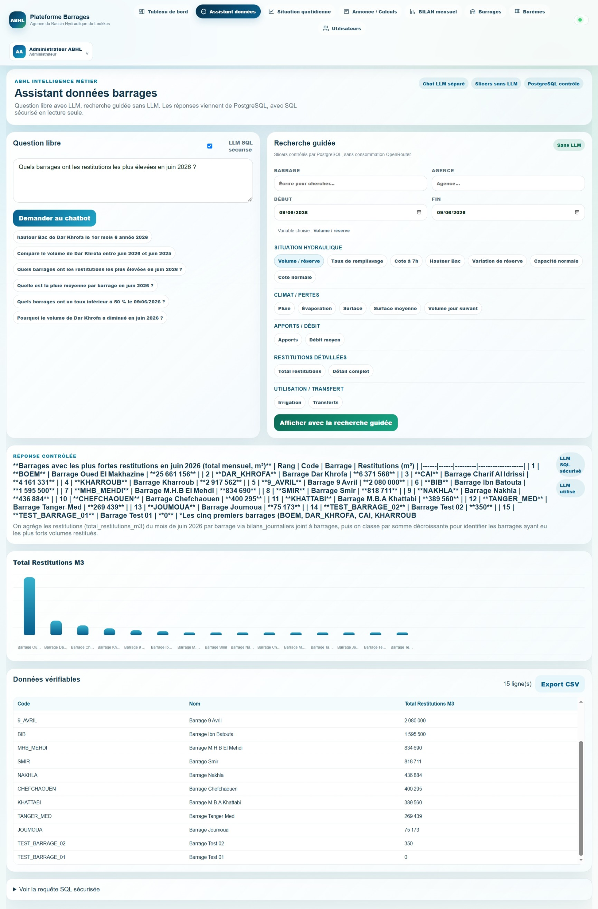

L’assistant propose deux approches complémentaires.

### Mode question libre

L’utilisateur peut formuler directement une question métier.

Exemples de besoins pris en charge :

- consulter l’évolution d’une variable ;
- comparer plusieurs barrages ;
- rechercher des valeurs sur une période ;
- identifier des barrages selon un seuil ;
- analyser les restitutions ;
- consulter les apports ;
- examiner la pluviométrie ;
- comparer plusieurs indicateurs.

Le flux est contrôlé :

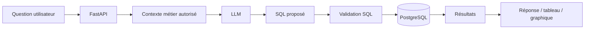

Le LLM ne possède pas un accès libre à PostgreSQL.

### Mode recherche guidée

La recherche guidée fonctionne sans génération SQL libre par LLM.

Elle permet d’explorer les données à partir de filtres prédéfinis, par exemple :

- barrage ;
- période ;
- agence ;
- situation hydraulique ;
- climat ;
- apports ;
- débit ;
- restitutions ;
- transferts.

Cette approche garantit un comportement déterministe pour les recherches les plus courantes.

---

## 4. Situation quotidienne

Le module **Situation quotidienne** permet de préparer les données nécessaires à la restitution journalière.

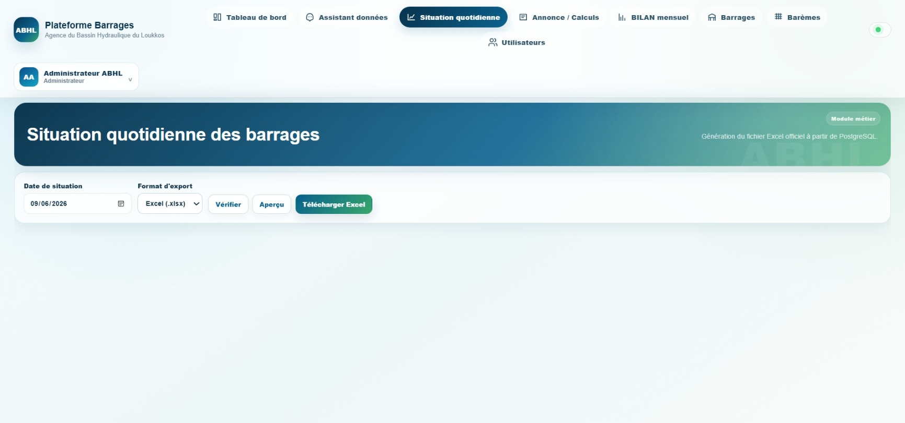

Le module permet notamment :

- de sélectionner une date ;
- de contrôler les données disponibles ;
- de récupérer les informations depuis PostgreSQL ;
- de préparer les valeurs nécessaires ;
- de générer la situation quotidienne ;
- de produire différentes vues de restitution.

La plateforme centralise ainsi un workflow auparavant fortement dépendant de traitements manuels dans les fichiers.

---

## 5. Annonce mensuelle

Le module **Annonce** prend en charge le processus mensuel associé aux barrages concernés.

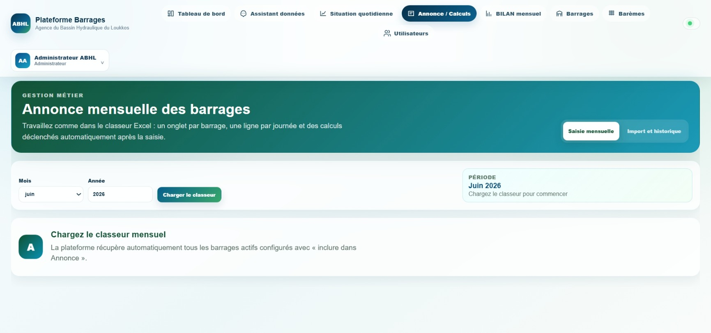

Il permet notamment :

- de sélectionner le mois et l’année ;
- de récupérer les barrages actifs concernés ;
- d’exploiter les données centralisées ;
- d’appliquer les règles métier correspondantes ;
- de gérer les valeurs nécessaires à l’annonce ;
- de préparer le classeur de restitution.

La logique métier est exécutée côté backend afin d’éviter une duplication des règles dans le frontend.

---

## 6. BILAN mensuel

Le module **BILAN** permet de travailler barrage par barrage sur les données mensuelles.

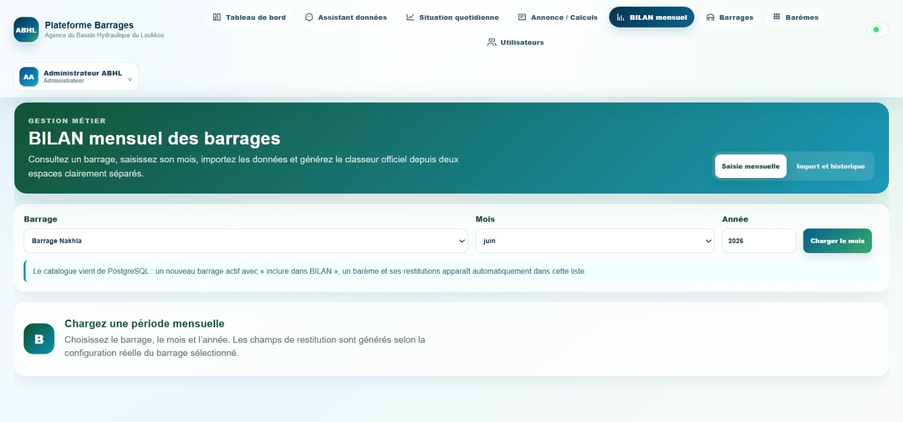

La sélection d’un barrage permet de charger dynamiquement :

- ses informations ;
- ses restitutions ;
- ses paramètres ;
- son barème ;
- ses données disponibles ;
- les éléments nécessaires aux calculs ;
- la restitution associée.

Le système exploite le référentiel PostgreSQL au lieu de dépendre d’une liste statique définie dans l’interface.

---

## 7. Gestion des barrages

Un module d’administration permet de gérer le référentiel des barrages directement dans la plateforme.

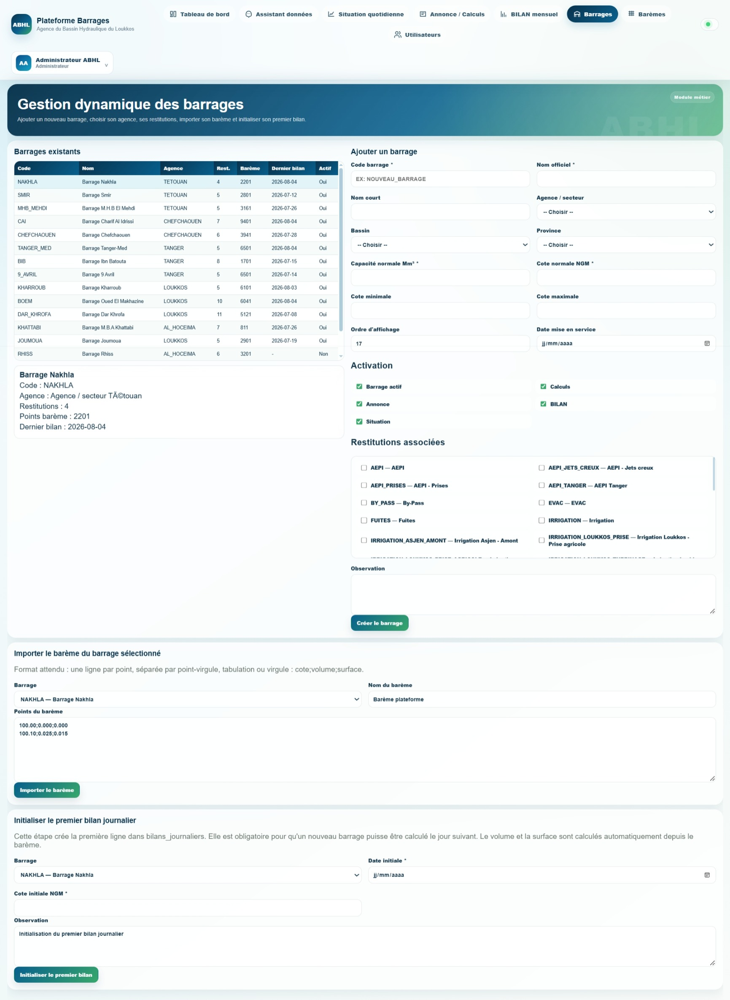

L’administrateur peut gérer notamment :

- le code du barrage ;
- le nom ;
- le bassin ;
- la province ;
- l’agence ou le secteur ;
- la capacité ;
- les paramètres de référence ;
- l’ordre d’affichage ;
- l’état actif / inactif ;
- la participation aux différents modules ;
- les types de restitution ;
- le barème associé.

Cette architecture permet de rendre la plateforme plus évolutive : l’ajout ou la modification d’un barrage est centralisé dans le référentiel.

---

## 8. Gestion et versionnement des barèmes

La plateforme intègre un module spécifique pour gérer les barèmes cote / volume / surface.

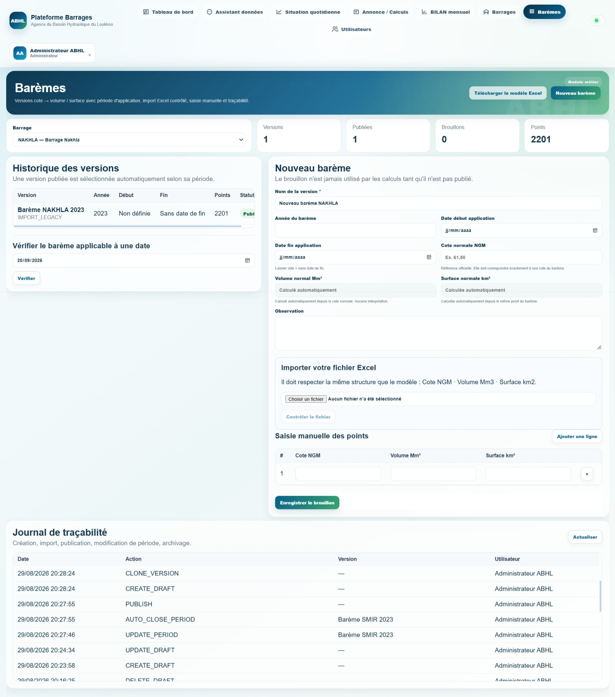

Chaque version de barème peut comporter :

- une période d’application ;
- une date de début ;
- une date de fin éventuelle ;
- un statut ;
- des points cote / volume / surface ;
- une cote normale ;
- les grandeurs normales associées ;
- un historique de version ;
- une source d’import ou de saisie.

### Cycle de vie d’une version

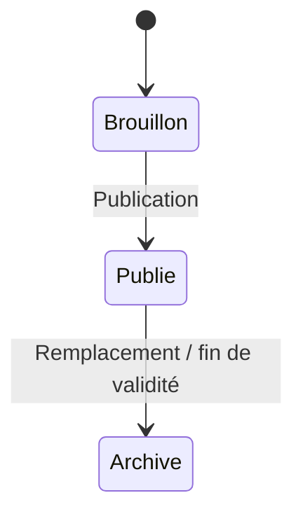

L’objectif est de garantir qu’un calcul historique utilise le barème correspondant à sa période de référence.

Cette approche évite qu’un changement futur modifie silencieusement l’interprétation des données passées.

---

## 9. Administration des utilisateurs

La plateforme dispose d’un espace dédié à la gestion des utilisateurs.

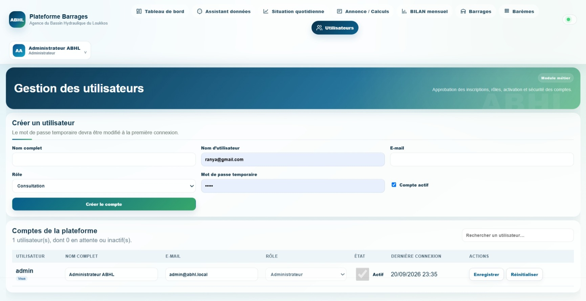

Le module permet notamment :

- de créer un utilisateur ;
- d’attribuer un rôle ;
- d’activer ou désactiver un compte ;
- de réinitialiser un mot de passe ;
- de consulter l’état du compte ;
- de contrôler les droits ;
- de suivre certaines informations de connexion.

Les rôles applicatifs permettent de distinguer les responsabilités de consultation, saisie, validation et administration.

---

# Logique métier hydraulique

Le backend regroupe les règles nécessaires aux principaux calculs hydrauliques utilisés par les différents modules.

Parmi les grandeurs manipulées :

- cote ;
- volume ;
- surface ;
- surface moyenne ;
- hauteur bac ;
- pluie ;
- évaporation ;
- variation de réserve ;
- restitutions ;
- apports ;
- débit ;
- taux de remplissage.

Les calculs sont centralisés pour éviter qu’un même indicateur soit calculé différemment selon l’écran ou le module.

Cette logique est utilisée par plusieurs composants de la plateforme :

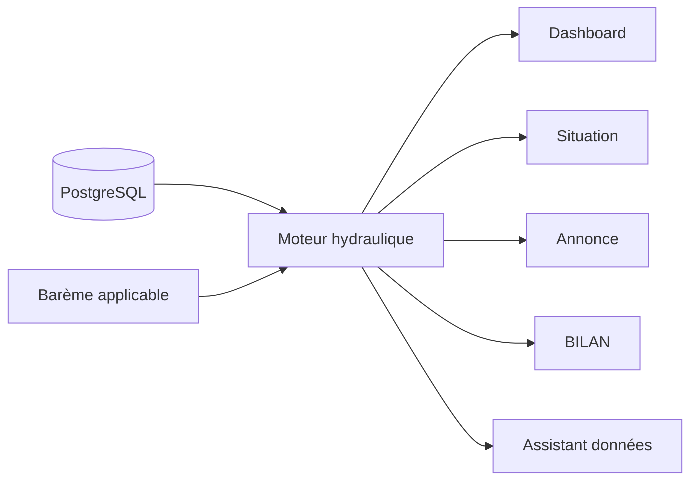

---

# Gestion des données

PostgreSQL joue le rôle de **source structurée principale**.

La plateforme s’appuie sur des tables et référentiels permettant de relier :

- barrages ;
- bassins ;
- provinces ;
- bilans journaliers ;
- journées de situation ;
- restitutions ;
- transferts ;
- mesures particulières ;
- barèmes ;
- utilisateurs ;
- rôles ;
- historiques ;
- imports.

Cette organisation offre plusieurs avantages :

- cohérence des données ;
- historique exploitable ;
- requêtes analytiques ;
- mutualisation entre modules ;
- meilleure traçabilité ;
- limitation de la duplication ;
- évolution plus simple du système.

---

# Sécurité de l’assistant NL-to-SQL

L’assistant constitue une fonctionnalité importante du projet, mais son accès à la base est volontairement limité.

La sécurité repose notamment sur :

- l’autorisation de requêtes de lecture uniquement ;
- la validation des requêtes générées ;
- l’interdiction des opérations d’écriture ;
- l’exclusion de tables sensibles ;
- la limitation du nombre de lignes retournées ;
- l’exécution en mode read-only ;
- un délai maximal d’exécution ;
- un contrôle du schéma SQL utilisé.

Le principe est le suivant :

> **Le modèle peut proposer une requête, mais il ne possède pas la base de données et ne décide pas seul de ce qui peut être exécuté.**

---

# Compatibilité avec les workflows Excel

Une partie importante du projet concerne la continuité avec les restitutions déjà utilisées dans les processus métier.

La plateforme conserve donc une couche dédiée à :

- l’import de données structurées ;
- la préparation des informations ;
- la génération de documents ;
- les contrôles de cohérence ;
- la reproduction des structures nécessaires aux restitutions.

Dans cette architecture, Excel n’est pas utilisé comme base centrale permanente.

Le principe adopté est :

```text
Données métier
     ↓
PostgreSQL
     ↓
Calculs / validations
     ↓
Application web
     ↓
Restitutions Excel / PDF lorsque nécessaire
```

---

# Traçabilité

La plateforme a été pensée pour conserver une meilleure visibilité sur les opérations et les données utilisées.

Selon les modules, le système peut exploiter ou conserver :

- la date de référence ;
- le barrage ;
- la source ;
- la période ;
- la version de barème ;
- l’utilisateur ;
- l’état de publication ;
- l’historique d’import ;
- les événements d’authentification ;
- les actions administratives.

Cette approche permet de mieux suivre l’origine des données et l’évolution des référentiels.

---

# Stack technique

| Couche | Technologies / approche |
|---|---|
| Frontend | React, Vite, JavaScript, CSS |
| Backend | Python, FastAPI, Pydantic |
| Base de données | PostgreSQL |
| Accès aux données | SQLAlchemy, SQL métier |
| Authentification | JWT, rôles et permissions |
| Analyse | Agrégations PostgreSQL, services FastAPI |
| Assistant | NL-to-SQL sécurisé + recherche guidée |
| Documents | Génération de restitutions Excel / PDF |
| Architecture | API modulaire, services métier, référentiels dynamiques |

---

# Organisation du projet

```text
.
├── backend/
│   ├── app/
│   │   ├── main.py
│   │   ├── config.py
│   │   ├── database.py
│   │   ├── modules/
│   │   │   ├── auth/
│   │   │   ├── dashboard/
│   │   │   ├── assistant_data/
│   │   │   ├── situation/
│   │   │   ├── annonce/
│   │   │   ├── bilan/
│   │   │   ├── calculs/
│   │   │   ├── barrages/
│   │   │   ├── barrage_admin/
│   │   │   ├── baremes/
│   │   │   ├── restitutions/
│   │   │   └── imports/
│   │   └── services/
│   ├── migrations/
│   └── sql/
│
├── frontend/
│   ├── public/
│   └── src/
│       ├── auth/
│       ├── components/
│       └── pages/
│
├── demo/
│   ├── 1.jpeg
│   ├── 2.jpeg
│   ├── 3.jpeg
│   ├── 4.jpeg
│   ├── 5.jpeg
│   ├── 6.jpeg
│   ├── 7.jpeg
│   ├── 8.jpeg
│   └── 9.jpeg
│
└── .gitignore
```

---

# Principaux modules backend

| Module | Rôle |
|---|---|
| `auth` | Authentification, sécurité, rôles et sessions |
| `dashboard` | KPI, agrégations et séries temporelles |
| `assistant_data` | Assistant NL-to-SQL et recherche guidée |
| `calculs` | Calculs hydrauliques |
| `situation` | Situation quotidienne et restitutions |
| `annonce` | Workflow mensuel Annonce |
| `bilan` | Workflow BILAN |
| `baremes` | Gestion des versions de barèmes |
| `barrage_admin` | Administration du référentiel des barrages |
| `restitutions` | Gestion des types de restitution |
| `imports` | Import, validation et historique |

---

# Une architecture métier intégrée

Le projet relie plusieurs composants qui étaient auparavant plus fortement dépendants de traitements séparés.

```text
                    Utilisateurs
                         │
                         ▼
                  React / Vite
                         │
                         ▼
                      FastAPI
                         │
          ┌──────────────┼──────────────┐
          │              │              │
          ▼              ▼              ▼
   Calculs métier   Assistant data   Restitutions
          │              │              │
          └──────────────┼──────────────┘
                         │
                         ▼
                    PostgreSQL
```

Le cycle métier peut ainsi être représenté par :

**saisie / import → validation → stockage → calcul → analyse → restitution → traçabilité**

---

# Points structurants du projet

### Centralisation

Les principaux modules exploitent un même socle PostgreSQL.

### Cohérence métier

Les calculs importants sont regroupés côté backend afin d’éviter les implémentations divergentes.

### Gestion temporelle

Les versions de barèmes permettent de distinguer les règles applicables selon les périodes.

### Sécurité

Les utilisateurs, rôles, sessions et droits font partie de l’architecture de la plateforme.

### Assistant contrôlé

L’intégration de l’IA est encadrée par une couche de validation et un accès SQL en lecture seule.

### Extensibilité

Le référentiel des barrages est administrable et alimente dynamiquement les autres modules.

### Continuité opérationnelle

La plateforme conserve la capacité de produire des restitutions compatibles avec les besoins métier existants.

---

# Confidentialité de cette version publique

Ce dépôt a été préparé spécifiquement pour une publication publique.

Il ne contient pas :

- de fichier `.env` réel ;
- de clé API ;
- de mot de passe ;
- de sauvegarde PostgreSQL ;
- de dump de base de données ;
- de données opérationnelles internes ;
- de classeurs métier confidentiels distribués avec le dépôt ;
- d’exports opérationnels ;
- de documents internes ;
- de fichiers de travail confidentiels du stage.

Les captures du dossier `demo/` sont utilisées uniquement pour illustrer les interfaces et les principaux modules de la plateforme.

---

# Contexte de réalisation

Ce projet a été développé dans le cadre d’un **stage au sein de l’Agence du Bassin Hydraulique du Loukkos (ABHL)**.

Il mobilise plusieurs domaines complémentaires :

- développement backend ;
- développement frontend ;
- modélisation PostgreSQL ;
- ingénierie des données ;
- logique métier hydraulique ;
- automatisation de traitements ;
- sécurité applicative ;
- visualisation de données ;
- génération documentaire ;
- intégration d’un assistant de données basé sur le langage naturel.

---

## Résumé

La **Plateforme intégrée de gestion et de suivi des barrages — ABHL** regroupe dans une même application :

**gestion des barrages · données hydrauliques · calculs métier · dashboard · situation quotidienne · annonce · BILAN · barèmes versionnés · administration · sécurité · assistant intelligent de données · restitutions**

L’objectif principal est de disposer d’un système centralisé, cohérent, traçable et évolutif autour du suivi hydraulique des barrages.
