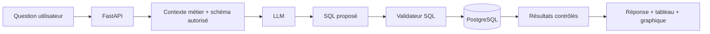
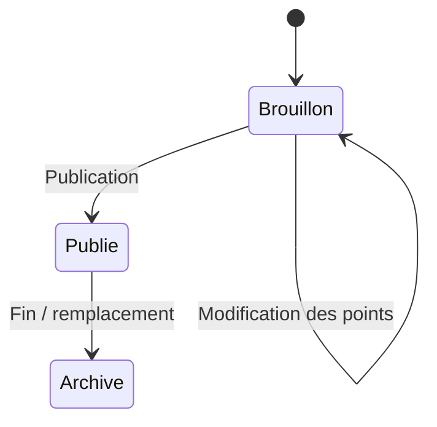
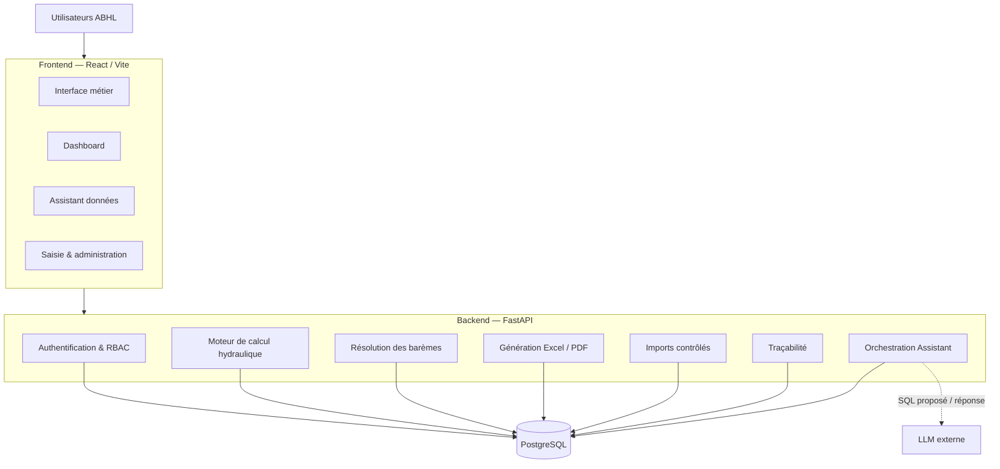
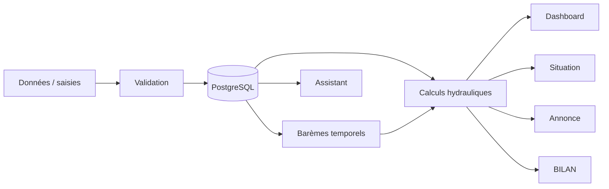

<div align="center">


# Plateforme intelligente de gestion des barrages — ABHL

### Système métier full-stack pour le suivi hydraulique, les calculs, la génération documentaire, la gouvernance des barèmes et l'interrogation intelligente des données

**Projet développé dans le cadre d'un stage au sein de l'Agence du Bassin Hydraulique du Loukkos (ABHL).**

<br/>


</div>

---

> **Version publique portfolio**
>
> Ce dépôt présente l'architecture, le code applicatif et les interfaces du projet.  
> Les données internes, sauvegardes de base de données, identifiants, secrets, fichiers opérationnels et documents confidentiels de l'ABHL ne sont pas publiés.

# Vision du projet

La **Plateforme Barrages** a été conçue pour transformer un ensemble de traitements hydrauliques, de saisies quotidiennes, de calculs métier et de classeurs Excel en un **système d'information centralisé, sécurisé et traçable**.

L'objectif n'est pas simplement de remplacer une feuille Excel par une interface web. Le projet met en place une véritable architecture métier dans laquelle :

- **PostgreSQL devient la source structurée de vérité** ;
- les calculs hydrauliques sont centralisés dans le backend ;
- les règles métier sont réutilisées par plusieurs modules ;
- les classeurs et restitutions sont générés à partir des données contrôlées ;
- les barèmes deviennent versionnés et applicables dans le temps ;
- le tableau de bord permet une lecture immédiate de la situation hydraulique ;
- un assistant de données permet d'interroger la base en langage naturel avec une couche SQL sécurisée ;
- l'authentification, les rôles et la traçabilité encadrent l'utilisation de la plateforme.

Le résultat est une application qui relie **données hydrauliques, calculs, gouvernance métier, visualisation, exports et intelligence assistée** dans un même environnement.

---

# Aperçu de la plateforme

## 1. Accès sécurisé

La plateforme possède son propre espace d'authentification et de gestion des comptes.

Les fonctionnalités sont accessibles en fonction du rôle de l'utilisateur, avec une séparation entre les profils d'administration, de saisie, de validation et de consultation.


### Principes de sécurité intégrés

- authentification centralisée ;
- mots de passe stockés sous forme sécurisée côté backend ;
- jetons JWT ;
- expiration des sessions ;
- verrouillage après plusieurs tentatives de connexion échouées ;
- changement de mot de passe ;
- activation/désactivation des comptes ;
- contrôle des permissions par rôle ;
- journalisation d'actions d'authentification et d'administration.

---

# Tableau de bord hydraulique

Le tableau de bord fournit une **vision consolidée de l'état des barrages** à partir des données stockées dans PostgreSQL.


Il rassemble dans une seule interface :

- nombre de barrages suivis ;
- volume total stocké ;
- taux global de remplissage ;
- apports ;
- restitutions ;
- évaporation ;
- évolution du volume sur une période ;
- évolution du taux de remplissage ;
- répartition par agence / secteur ;
- comparaison avec une période de référence ;
- bilan hydraulique entrées / sorties ;
- classement et surveillance des barrages ;
- indicateurs individuels par barrage ;
- comparaison N-1 ;
- statut de surveillance ;
- analyse personnalisée multi-variables ;
- filtres temporels, géographiques et par barrage.

L'utilisateur peut donc passer d'une **vue stratégique globale** à une **analyse détaillée** sans changer d'outil.

### Analyse personnalisée

Le module permet également de construire des analyses à partir de plusieurs variables hydrauliques :

`Cote à 7h` · `Volume` · `Taux de remplissage` · `Surface` · `Pluie` · `Hauteur bac` · `Évaporation` · `Apports` · `Restitutions` · `Débit moyen` · `Variation de volume` · `Volume N-1`

---

# Assistant intelligent de données

L'un des composants les plus avancés de la plateforme est l'**Assistant données barrages**.


Deux modes complémentaires sont proposés.

### Question libre avec LLM

L'utilisateur peut poser une question métier directement en français, par exemple :

- évolution d'une variable pour un barrage ;
- comparaison entre plusieurs périodes ;
- classement par restitution ;
- recherche des barrages sous un seuil de remplissage ;
- analyse des apports ou de la pluviométrie ;
- comparaison entre barrages.

Le modèle n'est pas connecté directement à la base de données. Il intervient dans une chaîne contrôlée :



### Recherche guidée sans LLM

Pour les besoins déterministes, l'utilisateur peut interroger les données via des filtres structurés :

- barrage ;
- agence ;
- période ;
- situation hydraulique ;
- climat / pertes ;
- apports / débit ;
- restitutions détaillées ;
- irrigation / transferts.

Cette voie fonctionne directement avec PostgreSQL et ne dépend pas d'un modèle externe.

### Sécurisation SQL

La couche SQL de l'assistant applique plusieurs protections :

- seules les requêtes `SELECT` / `WITH ... SELECT` sont autorisées ;
- blocage des opérations d'écriture et d'administration SQL ;
- interdiction des catalogues système ;
- exclusion de tables sensibles ;
- exécution dans une transaction **read-only** ;
- délai maximal d'exécution ;
- limite automatique du nombre de lignes retournées ;
- validation du schéma et des tables utilisées.

Cette architecture permet de bénéficier du langage naturel **sans donner au LLM le contrôle de la base de données**.

---

# Situation quotidienne des barrages

Le module **Situation quotidienne** transforme les données centralisées en document opérationnel.


À partir d'une date donnée, la plateforme peut :

- vérifier la disponibilité des données nécessaires ;
- préparer un aperçu ;
- générer le classeur de situation ;
- produire les différentes vues nécessaires aux restitutions ;
- exploiter directement les informations disponibles dans PostgreSQL.

La logique de génération est séparée de l'interface utilisateur : les données sont récupérées, contrôlées et préparées dans le backend avant la création du document.

---

# Annonce mensuelle des barrages

Le module **Annonce** transpose le fonctionnement métier mensuel dans une interface applicative.


La plateforme récupère automatiquement les barrages actifs configurés pour participer au processus d'annonce.

Le module centralise :

- choix du mois et de l'année ;
- récupération dynamique des barrages concernés ;
- saisie métier ;
- calculs déclenchés à partir des données ;
- historique et import ;
- génération du classeur mensuel.

L'objectif est de conserver la logique métier attendue tout en retirant la dépendance à une manipulation manuelle dispersée entre plusieurs fichiers.

---

# BILAN mensuel par barrage

Le module **BILAN mensuel** est organisé autour de chaque barrage.


La sélection d'un barrage pilote dynamiquement :

- les restitutions qui lui sont associées ;
- son barème ;
- ses paramètres ;
- les données disponibles pour la période ;
- les calculs du bilan ;
- la génération du classeur correspondant.

Le catalogue des barrages ne repose donc pas sur une liste figée dans le frontend : il provient de PostgreSQL et de la configuration métier.

---

# Gestion dynamique des barrages

La plateforme ne se limite pas à consulter un catalogue existant. Elle possède un module d'administration permettant de **faire évoluer le référentiel des barrages**.


Un administrateur peut gérer notamment :

- code et nom du barrage ;
- agence / secteur ;
- bassin ;
- province ;
- capacité normale ;
- cotes de référence ;
- ordre d'affichage ;
- état actif / inactif ;
- inclusion dans les différents modules ;
- types de restitutions associés ;
- import du barème ;
- initialisation du premier bilan journalier.

Cette conception rend l'application **extensible** : l'ajout d'un barrage ne doit pas nécessiter de reconstruire manuellement chaque écran.

---

# Barèmes versionnés et gouvernance temporelle

La gestion des barèmes a été transformée en un véritable module de gouvernance.


Chaque barrage peut disposer de plusieurs versions de barème avec :

- année ;
- période d'application ;
- date de début ;
- date de fin éventuelle ;
- statut de version ;
- points cote / volume / surface ;
- cote normale ;
- volume normal calculé ;
- surface normale calculée ;
- import Excel ;
- saisie manuelle ;
- historique des versions ;
- vérification du barème applicable à une date donnée.

### Cycle de vie



Une version publiée est traitée comme une référence métier contrôlée. Les modifications passent par la création ou la gestion d'une version, ce qui permet d'éviter qu'un changement futur altère silencieusement l'interprétation d'une période passée.

### Traçabilité

Le journal permet de suivre notamment :

- création de brouillon ;
- mise à jour ;
- publication ;
- modification de période ;
- fermeture automatique d'une période ;
- clonage / création de nouvelle version ;
- archivage.

---

# Administration des utilisateurs

La plateforme intègre un espace d'administration des comptes.


Le module permet :

- création de comptes ;
- choix du rôle ;
- activation / désactivation ;
- mot de passe temporaire ;
- obligation de changement à la première connexion selon le workflow ;
- réinitialisation du mot de passe ;
- consultation de l'état du compte ;
- suivi de la dernière connexion.

L'administration des utilisateurs fait donc partie du système lui-même, au lieu d'être gérée séparément de l'application.

---

# Architecture globale



---

# Organisation technique

```text
.
├── backend/
│   ├── app/
│   │   ├── main.py
│   │   ├── database.py
│   │   ├── config.py
│   │   ├── modules/
│   │   │   ├── auth/
│   │   │   ├── dashboard/
│   │   │   ├── assistant_data/
│   │   │   ├── situation/
│   │   │   ├── annonce/
│   │   │   ├── bilan/
│   │   │   ├── calculs/
│   │   │   ├── barrages/
│   │   │   ├── barrage_admin/
│   │   │   ├── baremes/
│   │   │   ├── restitutions/
│   │   │   └── imports/
│   │   └── services/
│   ├── migrations/
│   └── sql/
│
├── frontend/
│   ├── public/
│   └── src/
│       ├── auth/
│       ├── components/
│       └── pages/
│
├── demo/
│   ├── 1.jpeg
│   ├── 2.jpeg
│   ├── 3.jpeg
│   ├── 4.jpeg
│   ├── 5.jpeg
│   ├── 6.jpeg
│   ├── 7.jpeg
│   ├── 8.jpeg
│   └── 9.jpeg
│
└── .gitignore
```

---

# Les principaux modules backend

| Module | Responsabilité |
|---|---|
| `auth` | Authentification, sessions, rôles, sécurité et audit |
| `dashboard` | Agrégations, KPI, séries temporelles et analyses |
| `assistant_data` | NL-to-SQL contrôlé et recherche guidée |
| `calculs` | Calculs hydrauliques et préparation des données métier |
| `situation` | Situation quotidienne et génération de restitutions |
| `annonce` | Workflow mensuel de l'annonce |
| `bilan` | Workflow BILAN mensuel par barrage |
| `baremes` | Versions, périodes, points et résolution des barèmes |
| `barrage_admin` | Référentiel et création dynamique des barrages |
| `restitutions` | Types et valeurs de restitution |
| `imports` | Import, validation et contrôle des données |

---

# Modèle de données métier

PostgreSQL constitue le cœur de la plateforme.

Le modèle relie notamment :

- les barrages ;
- les agences / secteurs ;
- les bassins et provinces ;
- les journées de situation ;
- les bilans journaliers ;
- les restitutions ;
- les transferts ;
- les mesures spécifiques ;
- les versions de barèmes ;
- les points cote / volume / surface ;
- les utilisateurs et rôles ;
- les événements d'authentification ;
- les imports et contrôles.

Cette structure permet de sortir d'une logique de fichiers isolés et de disposer d'un **historique interrogeable, contrôlable et exploitable par tous les modules**.

---

# Moteur hydraulique

La plateforme centralise les grandeurs utilisées dans les traitements journaliers et mensuels.

Parmi les variables manipulées :

- cote ;
- volume ;
- surface ;
- surface moyenne ;
- hauteur bac ;
- pluie ;
- évaporation ;
- variation de réserve ;
- restitutions ;
- apports ;
- débit ;
- taux de remplissage ;
- références N-1.

L'intérêt architectural est essentiel : les modules **Dashboard**, **Calculs**, **Situation**, **Annonce**, **BILAN** et **Assistant données** travaillent autour du même socle de données et de règles, plutôt que de maintenir plusieurs interprétations indépendantes.

---

# Architecture orientée métier

La plateforme est structurée autour de services spécialisés plutôt qu'autour de pages isolées.



Cela facilite :

- la cohérence entre écrans ;
- la réutilisation des règles ;
- les contrôles de qualité ;
- l'évolution des modules ;
- la maintenance ;
- la traçabilité d'un résultat jusqu'à sa donnée source.

---

# Sécurité et contrôle d'accès

Les routes FastAPI sont protégées selon le niveau nécessaire.

Les rôles applicatifs sont organisés autour de profils tels que :

- `ADMIN`
- `SAISIE`
- `VALIDATEUR`
- `CONSULTATION`

Certaines opérations restent accessibles à tous les utilisateurs authentifiés, tandis que les actions de saisie, de validation ou d'administration nécessitent des privilèges adaptés.

Le backend applique également :

- contrôle des sessions ;
- audit d'authentification ;
- verrouillage après échecs répétés ;
- restrictions des endpoints d'administration ;
- séparation des responsabilités ;
- validation SQL spécifique pour l'assistant intelligent.

---

# Traçabilité et reproductibilité

Une attention importante a été portée à la capacité de comprendre **d'où vient une information et comment elle a été produite**.

Selon les modules, la plateforme conserve ou exploite :

- date de référence ;
- barrage ;
- source de donnée ;
- feuille / contexte d'import ;
- période métier ;
- version du barème applicable ;
- utilisateur à l'origine d'une opération ;
- journal d'actions ;
- état de publication ;
- historique d'import.

Cette approche rend possible une exploitation beaucoup plus robuste qu'une simple succession de fichiers locaux.

---

# Compatibilité avec les workflows Excel

Le projet a été construit autour d'un enjeu concret : **moderniser sans perdre les règles métier déjà matérialisées dans les classeurs utilisés par l'agence**.

Le backend possède donc une couche dédiée à :

- la lecture et la validation de données ;
- la reproduction des structures métier nécessaires ;
- la préparation de classeurs ;
- la génération d'exports ;
- les contrôles de cohérence ;
- la comparaison des résultats applicatifs avec les références de travail.

La plateforme ne traite pas Excel comme une base de données permanente : **PostgreSQL porte les données**, tandis qu'Excel devient un format d'entrée, de contrôle ou de restitution lorsque le processus métier l'exige.

---

# Ce qui rend le projet particulièrement intéressant

### 1. Ce n'est pas un simple CRUD

Le système combine référentiels, calculs hydrauliques, règles temporelles, documents, historique, analytics et IA.

### 2. Les données ont une source de vérité unique

Les différents écrans exploitent le même socle PostgreSQL au lieu de multiplier les copies de données.

### 3. Les barèmes sont temporels

Une règle ou un barème peut évoluer sans obliger l'application à considérer le présent comme valable pour tout l'historique.

### 4. L'IA est encadrée

L'assistant utilise le langage naturel, mais la lecture de la base reste soumise à une validation SQL stricte et à une transaction read-only.

### 5. Le référentiel est extensible

Les barrages, restitutions et paramètres sont gérés dans la plateforme et alimentent dynamiquement les autres modules.

### 6. La restitution documentaire reste intégrée

Le système combine application web moderne et contraintes opérationnelles de génération de documents structurés.

### 7. La sécurité fait partie de l'architecture

Authentification, rôles, verrouillage, audit et permissions sont intégrés au backend et non ajoutés comme une couche décorative.

---

# Stack technique

| Couche | Technologies / approche |
|---|---|
| Frontend | React, Vite, JavaScript, CSS |
| Backend | Python, FastAPI, Pydantic |
| Base de données | PostgreSQL |
| ORM / accès SQL | SQLAlchemy + SQL métier contrôlé |
| Authentification | JWT, RBAC, audit |
| Data / analytics | Agrégations PostgreSQL + services FastAPI |
| IA | Assistant NL-to-SQL sécurisé + recherche guidée |
| Documents | Génération et préparation Excel / PDF |
| Architecture | API modulaire, services métier, référentiel dynamique |

---

# Une plateforme pensée comme un système complet

Le projet relie plusieurs dimensions généralement traitées séparément :

```text
                    ┌─────────────────────┐
                    │     Utilisateurs    │
                    └──────────┬──────────┘
                               │
                     ┌─────────▼─────────┐
                     │   React / Vite    │
                     └─────────┬─────────┘
                               │
                     ┌─────────▼─────────┐
                     │      FastAPI      │
                     └─────────┬─────────┘
                               │
        ┌──────────────────────┼──────────────────────┐
        │                      │                      │
┌───────▼────────┐   ┌─────────▼────────┐   ┌────────▼─────────┐
│ Calculs métier │   │ Assistant Data   │   │ Exports / Docs   │
└───────┬────────┘   └─────────┬────────┘   └────────┬─────────┘
        │                      │                      │
        └──────────────────────┼──────────────────────┘
                               │
                     ┌─────────▼─────────┐
                     │    PostgreSQL     │
                     └───────────────────┘
```

Cette combinaison permet de traiter le cycle complet :

**saisie → validation → stockage → calcul → analyse → décision → restitution → traçabilité**

---

# Confidentialité de cette version publique

Ce dépôt est volontairement **assaini pour une présentation publique**.

Il ne contient pas :

- de fichier `.env` réel ;
- de clé API ;
- de mot de passe ;
- de sauvegarde PostgreSQL ;
- de dump de données ;
- de base opérationnelle de l'agence ;
- de classeurs métier internes distribués avec le dépôt ;
- d'exports opérationnels ;
- de documents confidentiels ;
- de fichiers de travail internes du stage.

Les captures du dossier `demo/` sont conservées pour illustrer les principaux modules de l'interface.

---

# Contexte

Ce projet a été réalisé dans le cadre d'un **stage au sein de l'Agence du Bassin Hydraulique du Loukkos (ABHL)** autour de la modernisation du suivi et de la gestion des barrages.

Il illustre un travail transversal mêlant :

**Data Engineering · Backend Engineering · Frontend Engineering · PostgreSQL · Business Logic · Hydraulic Data · Data Visualization · Security · AI-assisted Analytics · Excel Automation**

---

<div align="center">

### From hydraulic data to an integrated decision-support platform.

**React · FastAPI · PostgreSQL · Secure NL-to-SQL · Hydraulic Business Logic**

</div>
